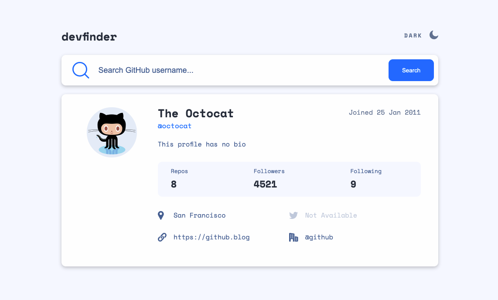

# Frontend Mentor - GitHub user search app solution

This is a solution to the [GitHub user search app challenge on Frontend Mentor](https://www.frontendmentor.io/challenges/github-user-search-app-Q09YOgaH6). Frontend Mentor challenges help you improve your coding skills by building realistic projects.

## Table of contents

- [Overview](#overview)
  - [The challenge](#the-challenge)
  - [Screenshot](#screenshot)
  - [Links](#links)
- [My process](#my-process)
  - [Built with](#built-with)
  - [What I learned](#what-i-learned)
  - [Continued development](#continued-development)
  - [Useful resources](#useful-resources)
- [Author](#author)
- [Acknowledgments](#acknowledgments)

## Overview

### The challenge

Users should be able to:

- View the optimal layout for the app depending on their device's screen size
- See hover states for all interactive elements on the page
- Search for GitHub users by their username
- See relevant user information based on their search
- Switch between light and dark themes

### Screenshot

## Desktop Light Theme

## Desktop Dark Theme

## Tablet Light Theme

## Tablet Dark Theme

## Mobile Light Theme

## Mobile Dark Theme

### Links

- Solution URL: [https://github.com/Oobnala/dev-finder]
- Live Site URL:

### Built with

- Sass
- Flexbox
- CSS Grid
- Desktop-first workflow
- Axios
- [React](https://reactjs.org/) - JS library

### What I learned

During this project, I learned how to implement a dark and light theme switch animation using Sass. In addition, I used this project to practice with CSS Grid, Flexbox, and React.

### Continued development

Areas that I want to continue improving is writing cleaner code and Sass/CSS concepts. This project allowed me to practic CSS Flexbox and Grid which I still need work on. Also, I want to work on my approach for implementing a responsive design. For this project, I used a desktop-first workflow. I plan on doing a mobile-first workflow for my next project.

### Useful resources

- [CSS Grid Guide](https://css-tricks.com/snippets/css/complete-guide-grid/)
- [CSS Flexbox Guide](https://css-tricks.com/snippets/css/a-guide-to-flexbox/)

## Author

- Frontend Mentor - [@Oobnala](https://www.frontendmentor.io/profile/Oobnala)
